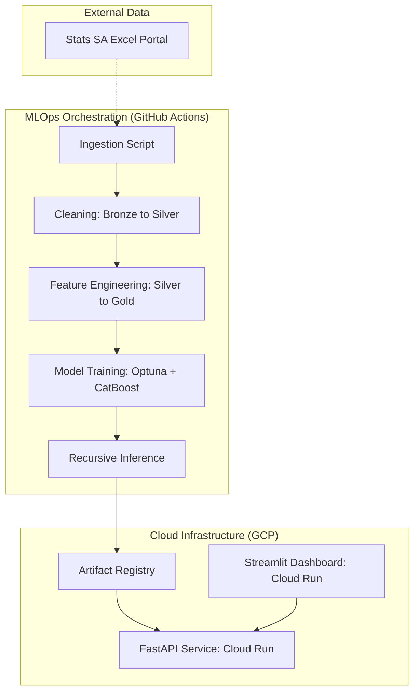

# South Africa CPI Nowcasting: Production-Grade ML System


## 📌 Executive Summary

This project is an end-to-end Machine Learning system (accessible via [web link](https://sa-cpi-ui-650579830744.europe-west1.run.app)) that provides Nowcasts for South Africa’s Consumer Price Index (CPI) across 11 economic categories. Originally a 3rd Place winning solution for the RMB CPI Nowcasting Challenge on Zindi, it has been evolved into a production-grade, decoupled application.

The system autonomously ingests monthly data from Statistics South Africa, executes a feature engineering pipeline, retrains optimized CatBoost models, and serves forecasts via a FastAPI backend and Streamlit dashboard.

## 🏗  System Architecture

The project follows a Decoupled Service Architecture and a Medallion Data Design, ensuring scalability and high availability.



## 🛠 Tech Stack

- **Languages** : Python 3.11

- **Modeling**: CatBoost Regressor, Optuna (Hyperparameter Tuning), Scikit-Learn

- **API**: FastAPI, Uvicorn, Pydantic

- **Dashboard**: Streamlit, Plotly Express

- **DevOps**: Docker, GitHub Actions (CI/CD)

- **Cloud**: Google Cloud Platform (Artifact Registry, Cloud Run, Secret Manager)

## 🔬 The Science: Modeling Strategy

1. **Feature Engineering (Gold Layer)**

**Auto-Regressive Lags**: 15 months of historical values.

**Vectorized Trend Analysis**: Efficiently calculating slope and momentum features over sliding windows.

**Cyclical Encoding**: Sine/Cosine transformations of months to capture annual seasonality (e.g., January school fees, July municipal hikes).

2. **Recursive Forecasting**

The system utilizes a sliding window inference logic. To forecast month 𝑁, it uses predicted values from 
N−1 to build features, allowing for multi-step horizons while maintaining temporal consistency.

## ⚙️ The Engineering: MLOps & Deployment
1. **Automated ETL Pipeline**

- A monthly GitHub Action triggers on the 25th (aligned with Stats SA releases).

- Idempotent Ingestion: Downloads and validates new data only if it hasn't been processed.

- Medallion Data Flow: Moves data from Raw → Silver (standardized long-format) → Gold (feature-engineered).

2. **Containerization & API**

- The Backend is containerized via a Docker build and deployed to GCP Cloud Run.

- Contract Enforcement: All API responses are validated via Pydantic schemas.

3. **Monitoring Dashboard**

The Streamlit UI provides:

- Interactive Nowcasts: Visualizing historical actuals vs. model predictions.

- Economic Insights: Automated calculation of Month-on-Month (MoM) and Year-on-Year (YoY) inflation rates.

- Model Health: Transparency into Feature Importance.


📁 Project Structure
```code

├── .github/workflows/        # Automation (Monthly Retrain & Deploy)
├── sa_forecaster_api/        # Backend Service
│   ├── src/                  # Ingestion, Cleaning, Features, Training
│   ├── data/                 # Bronze/Silver/Gold Data layers
│   ├── models/               # Joblib artifacts & Metrics JSON
│   ├── Dockerfile            # Optimized API Image
│   └── run_pipeline.py       # ML Pipeline Orchestrator
├── sa_forecaster_ui/                       # Frontend Service
│   ├── app.py                # Streamlit Dashboard
│   └── Dockerfile            # UI Container
└── README.md
```

## ⚖️ License & Acknowledgments

**License**: MIT

**Data Source**: Statistics South Africa

Created by Isaac Oluwafemi Ogunniyi
